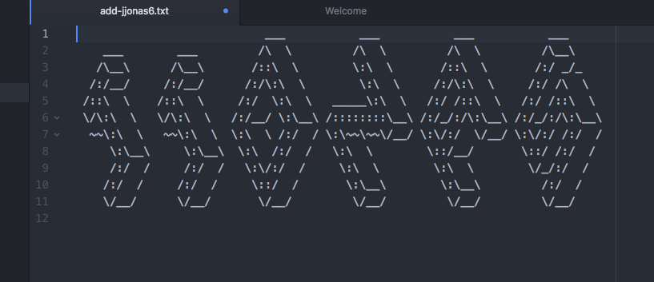

# Hello World

This page contains all of my projects for CIT 281 taken during the spring term of 2017. The projects use complex concepts such as node, json, ajax, and jquery to create simple web apps.

[Project 2](https://uo-cit.github.io/p2-17S-jjonas6/)
[Project 3](https://uo-cit.github.io/p3-17s-jjonas6/)
[Project 4](https://uo-cit.github.io/p4-17s-jjonas6/)
[Hello-World repo](https://github.com/jjonas6/hello-world)

